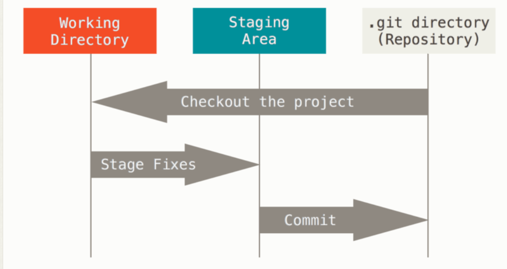
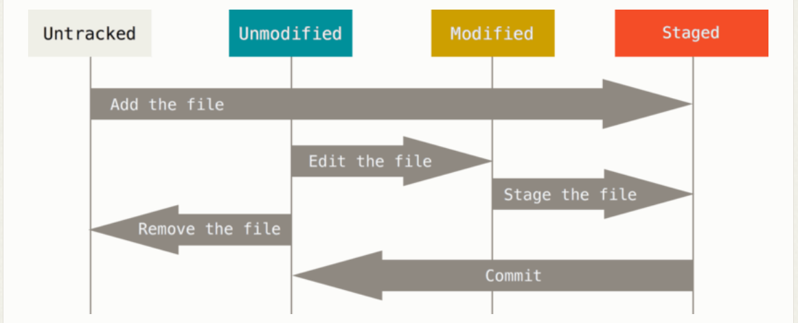

# Git

Reference --> The Git Book

## Introduction

- **Distributed Version Control System (DVCS)** --> no single point of failure.
- **Stores data as snapshots of the project over time** --> a stream of snapshots.
  - Every time you commit, or save the state of your project, Git takes a snapshot of what all your files look like at that moment and stores a reference to that snapshot.
  - If files have not changed, Git doesn't store the file again, just a link to the previous identical file it has already stored
- Nearly every operation is local --> if you're offline or off VPN you can still work and commit (to your local copy).
- **Integrity maintained** --> everything in Git is checksummed (SHA-1 hash) before it is stored and is then referred by that checksum. 
  - Git stores everything in its DB not by file name but by the hash value of its contents.
- **Generally only adds data** --> Can experiment without the danger of severely messing things up.

<br>

## The 3 states

### Modified

- You have changed the file but have not committed to your DB yet.

### Staged

- You have marked a modified file in its current version to go into your next commit snapshot.

### Committed

- The data is safely stored in your local DB.

<br>

## The 3 main sections of a Git project



### Working tree/directory

- A single checkout of 1 version of the project (files pulled out of the compressed DB in the Git directory and placed on disk to use or modify).

### Staging area

- A file (generally contained in your Git directory) that stores info about what will go into your next commit. 
- Also called the "index".

### The Git directory

- Where Git stores the metadata and object DB for your project.
- What is copied when you clone a repo from another computer.

<br>

## The basic Git workflow

1. Modify files in your working tree/directory.
2. Selectively stage just those changes you want to be part of your next commit, which adds only those changes to the staging area.
3. Do a commit, which takes the files as they are in the staging area and stores that snapshot permanently to your Git directory.

- If a particular version of a file is in the Git directory, it’s considered committed. 
- If it has been modified and was added to the staging area, it is staged. 
- If it was changed since it was checked out but has not been staged, it is modified.

<br>

## Git Configurations

- System config `[path]/etc/gitconfig`.
- Global config `~/.gitconfig` or `~/.config/git/config`.
- Local config `config` file in the Git directory (`.git/config`).
- `--system` (values applied to every user on the system and all their repos) < `--global` (values specifically for 1 user) < `--local` (default)
- `git config --list --show-origin` to view all settings and where they are coming from, or simply `git config --list`
- `git config <key>` to check the value of a specific key such as `user.name`
- `git config --show-origin rerere.autoUpdate` to check which config file had the final say in setting a particular value (if you get unexpected value).
- After installing Git, set your username and email address immediately (every Git commit uses this info)
  - `git config --global user.name "<name>"`
  - `git config --global user.email "<email>"`
  - `git config --global core.editor <editor>` (must specify full path on Windows to its executable file)
  - If you want to override this with a different name or email address for specific projects, run the above commands without `--global` when you're in that project.

<br>

## Git Basics

- `git help <verb>` or `git <verb> --help` or `man git-<verb>` or `git <verb> -h` (simple) to get help.

### Initialising a repo in an existing directory or cloning from an existing repo

1. Go into the working directory.
2. `git init`
3. To start tracking: `git add <files>`, then `git commit -m "initial commit"`.

Otherwise, `git clone <url> (name)`

### Recording changes to the repo

- After setting up the bona fide Git repo and a checkout/working copy of its files, record changes when fit to do so.
- **Tracked files** --> Files that were in the last snapshot, as well as any newly staged files that can be unmodified, modified or staged.
- **Untracked files** --> Any files in my working directory that were not in my last snapshot + not in my staging area.
- Clean working directory: no modification from tracked files, no untracked files.



- `git status` or `git status -s` (short) to check the state of my files.
  - `??` --> new files that aren't tracked.
  - `A` --> new files that have been added to the staging area.
  - `M` --> modified files.
- **`git add <file>`** to begin tracking a new file/directory. Also used to stage files and do other things like marking merge-conflicted files as resolved.
  - "Add precisely this content to the next commit"

### `.gitignore`

- Blank lines or lines starting with `#` are ignored.
- Standard glob patterns (simplified regex that shells use) work, and will be applied recursively throughout the entire working tree.
  - `*` matches 0+ characters.
  - `[abc]` matches any char inside the brackets e.g., a, b, or c.
  - `?` matches a single char.
  - `[0-9]` matches any char between them e.g., 0-9.
  - `a/**/z` would match nested directories e.g., a/z, a/b/z, a/b/c/z etc.
  - Start patterns with a forward slash `/` to avoid recursivity. End patterns with a forward slash `/` to specify a directory.
  - Negate a pattern by starting it with an exclamation point `!`.
- It's possible to have multiple `.gitignore` files of which apply only to the files under the directory where they are located.

```bash
# ignore all .a files
*.a

# but do track lib.a, even though you're ignoring .a files above
!lib.a

# only ignore the TODO file in the current directory, not subdir/TODO
/TODO

# ignore all files in any directory named build
build/

# ignore doc/notes.txt, but not doc/server/arch.txt
doc/*.txt

# ignore all .pdf files in the doc/ directory and any of its subdirectories
doc/**/*.pdf
```

### `git diff`

- `git diff` --> What have you changed but not yet staged? If you've staged all of your changes, this won't return an output.
- `git diff --staged` --> Compares your staged changes to your last commit.
  - Or `git diff --cached`

### `git commit` and other useful cmds

- `git commit -v` to put diffs of files in as part of the commit msg.
  - `-m` for inline msg.
  - `-a` to skip the staging area and makes Git stage every file that is already tracked before doing the the commit, skipping `git add`.
  - `--amend` to change last commit msg if nothing is staged. Otherwise the commit itself changes.
- `git rm <file>` to remove a file from Git. `-f` for force removal if the file has been staged.
  - `--cached` to simply remove the file from the staging area but keep the file in the working tree. USeful if you forgot to add a pattern in `.gitignore`.
  - Glob patterns can be passed to this cmd. A thing to note: escape sequence in Git needs to be used inline e.g., `git rm log/\*.log` for `*`.
- `git mv file1 file2` to rename a file in Git. The changes will be shown if the file is not staged.

<br>

## Viewing the Commit History

- `git log` lists the commits made in reverse chronological order.
  - `-p` or `--patch` shows diff introduces in each commit. 
  - `-<num>` to limit the number of commits displayed.
  - `--since=2.weeks` gets the list of commits made in the last 2 weeks.
  - `--author`
  - `--grep` to search for key words in commit msg.
  - `--stat` pr `--shortstat` to see summary.
  - `--graph` to see branch and merge history.
  - `--relative-date`
  - `--name-only` --> show the list of files modified after the commit info.
  - `--name-status` --> show the list of files affected with added/modified/deleted info too.
  - `--pretty=[oneline | short | full | fuller]`
  - `--pretty=format:"%h - %an, %ar : %s"` allows me to specify my own log output format - useful when I'm generating output for machine parsing.
    - `%[H|T|P]` - commit hash / tree hash / parent hash
    - `%[h|t|p]` - abbreviated commit hash / tree hash / parent hash
    - `%[an|ae|ad|ar]` - author (person who originally wrote the work) name / email / date / relative date
    - `%[cn|ce|cd|cr]` - committer (person who last applied the work) name/email/date/relative date
    - `%s` - subject
  - `-- path/to/file` to limit the log output to commits that introduced a change to those files.
  - `--no-merges` to preventing the display of merge commits.

<br>

## Undoing Things

- Only amend commits that are still local and have not been pushed somewhere.
- `git commit --amend`
- To unstage a file: `git reset HEAD <file>` or `git restore --staged <file>`
- To unmodify a modified file: `git checkout -- <file>` (dangerous) or `git restore <file>` (dangerous)
- Anything you lose that was never committed is likely never to be seen again.

<br>

## Working with Remotes

- `git remote` to see which remote servers I have configured. If I cloned my repo I should at least see `origin`.
  - `-v` to show me the URLs.
  - If I have >1 remote, it would be listed. It means that we can pull contributions from any users listed and potentially push to one/more of these.
  - `show <remote>` to see more info about a particular remote.
  - `rename <original> <updated>` to rename remotes.
  - `remove <remote>` to remove a remote.
- `git remote add <shortname> <url>` --> once added you can `git fetch <shortname>`.
- `git fetch <remote>` only downloads the data to local but does not automatically merge it with any of my work.
- `git pull <remote>`
- `git push <remote> <branch>`
  - If someone else and I clone at the same time and they push upstream and then you push upstream, my push would be rejected. I will have to fetch their work first and incorporate it into mine before I am allowed to push.

<br>

## Tagging

- Git has the ability to tag specific points in a repo's history as being important.
- Typically people use tags to mark release points and so on.
- `git tag [-l|--list]` to list tags.
  - Listing tag wildcards requires `-l` and `--list` option.
- By default, we have to explicitly push tags to a shared server after we have created them: `git push origin <tagname>`

### Lightweight tags

- Like a branch that doesn't change - just a pointer to a specific commit.
- The commit checksum stored in a file with no other info being kept.
- `git tag <tag-name>`

### Annotated tags

- Recommended.
- Stored as full objects in the Git DB.
- Checksummed, with tagger name, email, date and a tagging message.
- `git tag -a <tagname> -m <msg>`
- `git tag -a <tag-name> <commit-checksum> -m <msg>` to tag previous commits.
- `git show` to see tag data with the commit that was tagged.
